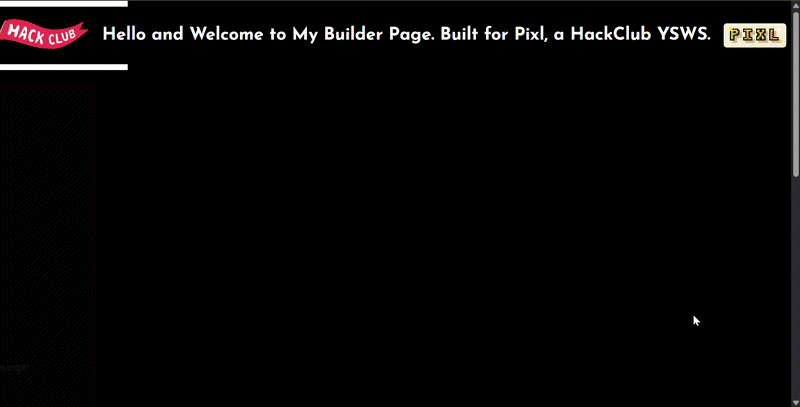
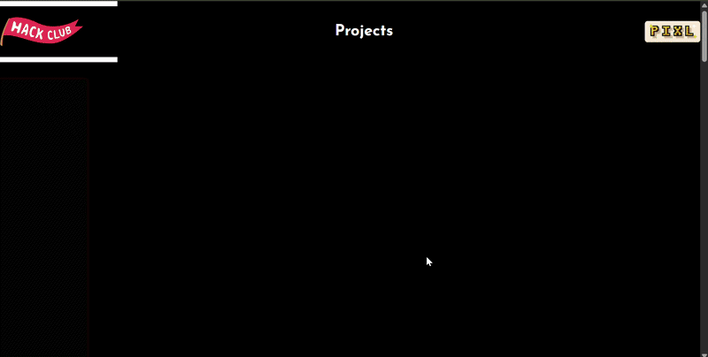

### MY BUILDER PAGE FOR PIXL - HACK CLUB (TAKSH NAHATA)
Hey everyone. This is just my simple builder page I made for this task:
***Ship a personal Builder page that introduces you. Deliver: (1) your name/handle and one line on what you build; (2) at least one thing you have made (a link or a screenshot counts); (3) a way to reach you (GitHub, email, or a social). Plain HTML/CSS is enough, no framework required. Deploy it somewhere public (GitHub Pages, Vercel, Neocities...) and use that live URL as your Playable URL, with the code on GitHub (README included). Make it yours: your colors, your vibe. ~4h.***

It includes all of this.

## What tech did I use?
I just kept it simple and used HTML and CSS.

## How can you run it/view it?
It's actually really simple. You just (1) clone the repo, (2) open up the index.html file in your browser, and that's it.

*I guess that's the benefit of only coding in HTML and CSS. Not really difficult to run it.*

## Show some screenshots/videos/gifs of it working
Bet! Here you go:

